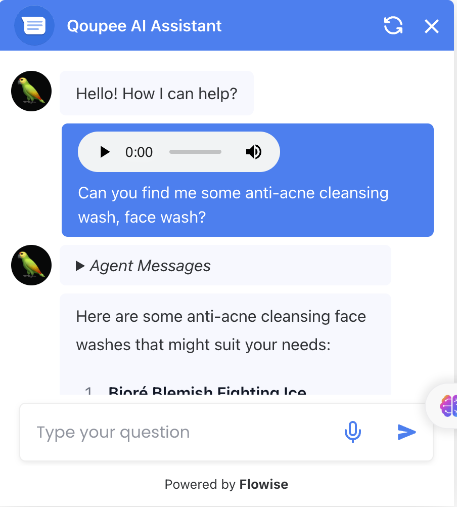
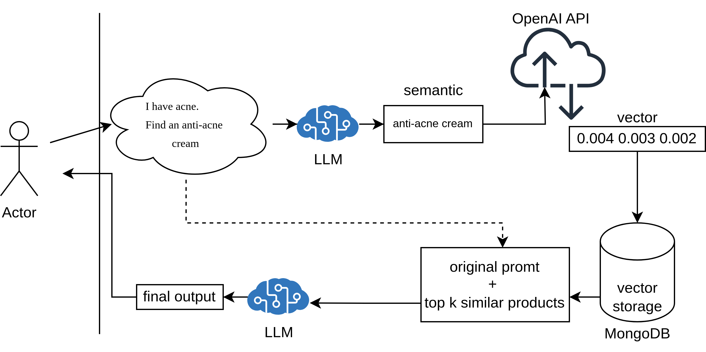

# *"QOUPEE"* - Retrieval Augmented Product Recommendation Assistant
Our Retrieval Augmented Product Recommendation Assistant enhances online shopping by integrating `semantic search` with Large Language Models (LLMs) to deliver `precise`, `real-time` product recommendations. It reduces the time customers spend searching, even with `complex queries` like “I need an acne face wash for oily skin,” and supports `multilingual search`. The system `dynamically adapts to database updates`, ensuring up-to-date recommendations. Additionally, it can `integrate with existing keyword, review, and category filters`, further refining accuracy. The standout feature is its ability to refine queries and provide context-aware suggestions, offering a highly personalized shopping experience. 

Demo video https://youtu.be/Lo2gs1e_7LM

  
   
    <em>Chat with voice</em>

## Tech Stack
This project leverages the following tools and technologies:
- **MongoDB**: Stores product descriptions and vector representations.
- **Flowise**: Used for rapid prototyping of LLM pipelines and building chatbots.
- **N8N**: Facilitates the creation of REST APIs for querying the database.
- **WordPress**: Serves as the platform for publishing mock products.
- **OpenAI API**: Powers text embeddings and LLM inferencing.
- **JavaScript**: Implements tools for the LLM agent.

## Data Collection
We’ve created a database with products in three categories: Facial Cleansing Washes, Single Board Computers, and Nightstands, all available on [qoupee.x2day.org](https://qoupee.x2day.org) (our Mock website). Each product entry includes the name, price, and images, with detailed URLs for easy browsing.

## Testing Environment 
Using our collected data, we’ve built a WordPress website to test our assistant. We added `embeddings` based on product descriptions and stored them in a MongoDB database, which also serves as a Vector Database.

  
   
  <em>WordPress product database sample</em>

## Recommendation Process
Our product is inspired by ['Retrieval-Augmented Generation - RAG'](https://aws.amazon.com/what-is/retrieval-augmented-generation/?nc1=h_ls), applied here as Retrieval Augmented Product Recommendation. The process is divided into two main parts: `Data Preprocessing` and `Product Search & Recommendation`.

### Database Preparation
Before making product recommendations, we need to prepare our vector search database. The diagram below illustrates the process of embedding product descriptions and storing the vector representations in MongoDB.

  
  
  <em>Database Preparation</em>

Vector representation is achieved by passing product descriptions to the OpenAI API, which generates vectors using the `text-embedding-3-large` model. The final dataset includes columns for Product Name, Product Description, Image URL, Product URL from our mock website and the product embedding from OpenAI.

### Product Search & Recommendation

  
   
    <em>Product Search & Recommendation</em>

The following outlines the step-by-step process of product search and recommendation:

1. The user enters a query, such as "I have acne. Find me some anti-acne cream."
2. The query is passed to an LLM that optimizes it for semantic clarity, refining it to something like "anti-acne cream."
3. The optimized query is then passed to the OpenAI API to generate a vector representation, similar to the vectors stored in the database.
4. This query vector is used to find the `k most semantically similar` products from the database.
5. The original user prompt is appended with the extracted products and passed to the LLM to generate the final output.
6. The LLM output is returned to the user as the response to their query.

## Qoupee Response in Korean

  

