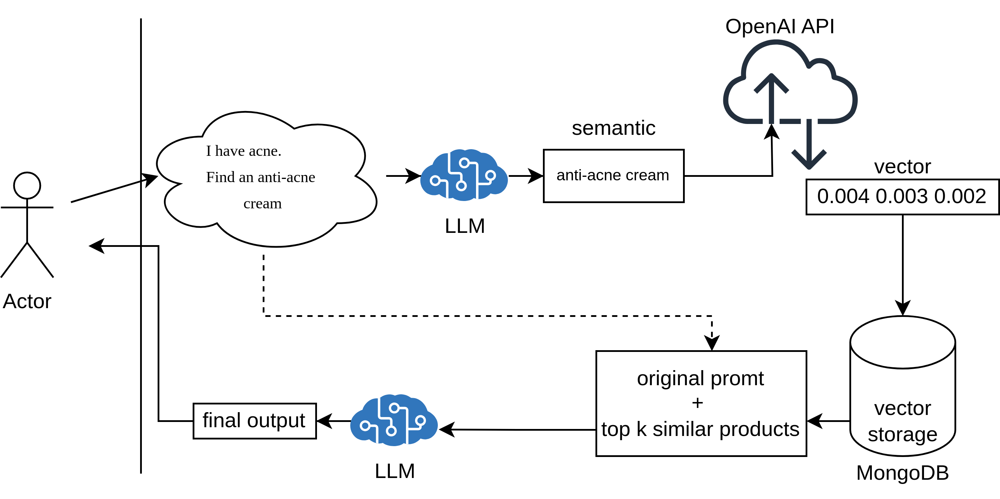

# *QOUPEE* - Retrieval Augmented Product Recommendation Assistant
Our Retrieval Augmented Product Recommendation Assistant enhances online shopping by integrating `semantic search` with Large Language Models (LLMs) to deliver `precise`, `real-time` product recommendations. It reduces the time customers spend searching, even with `complex queries` like “I need an acne face wash for oily skin,” and supports `multilingual search`. The system `dynamically adapts to database updates`, ensuring up-to-date recommendations. Additionally, it can `integrate with existing keyword, review, and category filters`, further refining accuracy. The standout feature is its ability to refine queries and provide context-aware suggestions, offering a highly personalized shopping experience.

## Data Collection
We’ve created a database with products in three categories: Facial Cleansing Washes, Single Board Computers, and Nightstands, all available on [qoupee.x2day.org](qoupee.x2day.org) (our Mock website). Each product entry includes the name, price, and images, with detailed URLs for easy browsing.

## Testing Environment 
Using our collected data, we’ve built a WordPress website to test our assistant. We added `embeddings` based on product descriptions and stored them in a MongoDB database, which also serves as a Vector Database.

  
   
  <em>WordPress product database sample</em>

## Data Processing 
Our product is inspired by ['Retrieval-Augmented Generation - RAG'](https://aws.amazon.com/what-is/retrieval-augmented-generation/?nc1=h_ls), applied here as Retrieval Augmented Product Recommendation.

  
  
  <em>Data Preparation</em>

  
   
    <em>product recommendation algo</em>

## Tech Stack
This project leverages the following tools and technologies:
- **MongoDB**: Stores product descriptions and vector representations.
- **Flowise**: Used for rapid prototyping of LLM pipelines and building chatbots.
- **N8N**: Facilitates the creation of REST APIs for querying the database.
- **WordPress**: Serves as the platform for publishing mock products.
- **OpenAI API**: Powers text embeddings and LLM inferencing.
- **JavaScript**: Implements tools for the LLM agent.
